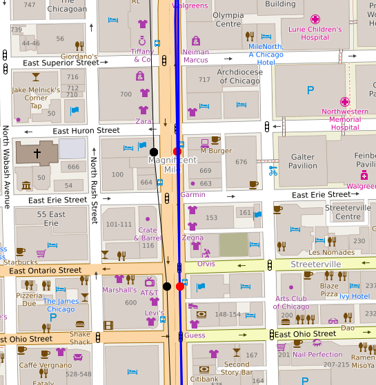

# map-matching-visualizer
Visualize map matching results on an interactive map, to aid the development of new strategies.

# Motivation
In working on projects like https://github.com/chihacknight/BetterTransit I found how tough accurate map matching is; that is, taking raw GPS traces and accurately snapping them to the street grid. Perhaps in some environments, this is easy, but in a dense city like Chicago, especially the parts with buses, the streets are very close together. I had started with OSRM's stock map matching, which sometimes has decent results, but I soon found that doing some preprocessing of the data can help.

Some problems arose.
* Once you start doing preprocessing, visualizing what you are doing is helpful.
* Getting OSM way data out of the raw matched data can also be nontrivial. Again, visualizing how the algorithm makes choices can be helpful.

Due to these problems, I decided to create a new project to visualize the results of map matching.

# Contributing

## Setup
### I want to do frontend development/visualization
Although there are many data dependencies currently baked into the implementation, there is a matcher and way querier class that removes dependence on a database and OSRM instance. Open up `cta_dump_viewer/views.py`. At the top, change the MATCHER and WAY_QUERIER variables to 'sample'.

The code dependencies here are managed with Anaconda (for now). The env file is in environment.yml, so after installing Anaconda you can create the environment this way:

`conda env create -f environment.yml`

That should only be needed once, and then you activate the environment each time you want to start the Django server like this:
`source activate map_matching_visualizer`
`python manage.py runserver`

You should be able to navigate to localhost:3000/cta_dump_viewer to see the results. Refer to cta_dump_viewer/views.py and cta_dump_viewer/templates/cta_dump_viewer for the current frontend code.

### I want to work with the data
The main dependencies are a Postgres database with a Chicago OSM extract loaded in (through osm2pgsql, with planet_osm_{ways,nodes} tables) for way querying, and an OSRM instance built on the same OSM extract for map matching. The goal is to give the app the ability to create this (see issues #15, #16, and #17), but at this point they are considered external dependencies.

To configure these dependencies:
* Database in map_matching_visualizer/conf.d/databases.conf.
* OSRM instance in map_matching_visualizer/conf.d/osrm.conf

After this is set up, you should be able to follow the frontend instructions to get the webapp running, but you will want to pick another matcher and way querier to get started (for instance, 'osrm' and 'fewest_nodes')

### Writing a new matcher interface
Matchers are located in core/matchers and inherit from the BaseMatcher base class. A new matcher needs to implement two methods:
* _match_output - Use self.raw_coords and self.radiuses and return raw output from the matcher service
* _generate_nodes - Use self.output and return a list of ordered OSM nodes

Unit Tests for new matchers are appreciated (see core/matchers/test_osrm.py, for example)

To test out a new matcher on the CTA Dump Viewer page, add it to cta_dump_viewer/views.py#AVAILABLE_MATCHERS, and then you can reference it from MATCHER

### Writing a new way querier
Way Queriers are located in core/way_queriers and inherit from the BaseWayQuerier base class. A new way querier needs to implement two methods:
* _generate_ways - Use self.node_pairs and return a list of OSM ways
* _generate_ways_nodes - Use self.ways and return a dict of coordinates that makes up the way's shape (used for visualization)

To test out a new way querier on the CTA Dump Viewer page, add it to cta_dump_viewer/views.py#AVAILABLE_WAY_QUERIERS, and then you can reference it from WAY_QUERIER

### Running tests
py.test is used, so once you activate the environment you can just run:
`py.test`

## Code Organization
The code is divided into three main directories:
### core
core contains code relating to the main technical goal of this project, understanding map matching, which can be shared between different applications.
  * matchers - Map matcher service interfaces, like OSRM
  * way_queriers - Way queriers, each of which should encapsulate an algorithm for converting a list of OSM node pairs to OSM ways

### cta_dump_viewer
cta_dump_viewer contains a Django web app that uses the OSM matchers and way queriers from *core* to apply map matching to data from the [CTA Passenger Counts Data](http://www.moomers.org/cta-passenger-counts-data/). The structure here is standard Django (models.py, views.py, templates/*)

### map_matching_visualizer
Basic Django boilerplate. This usually isn't touched, except to change configuration or to add url routing rules.

